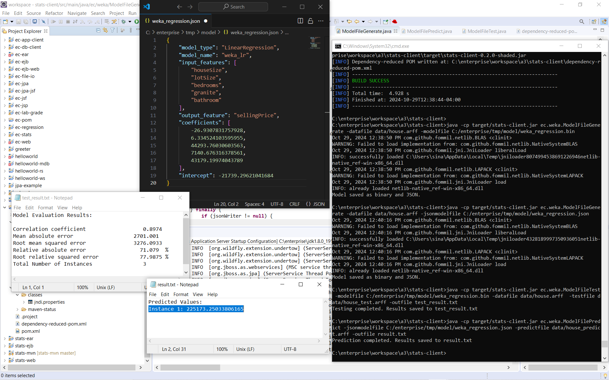
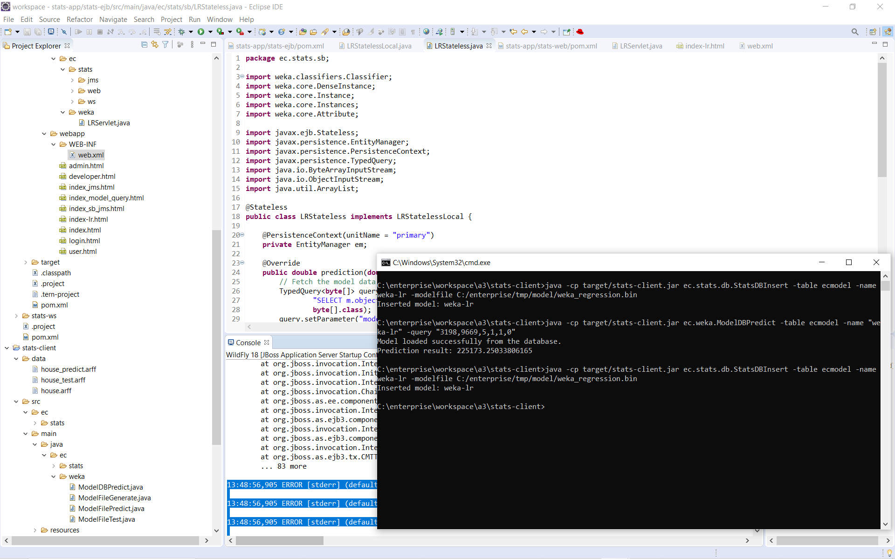
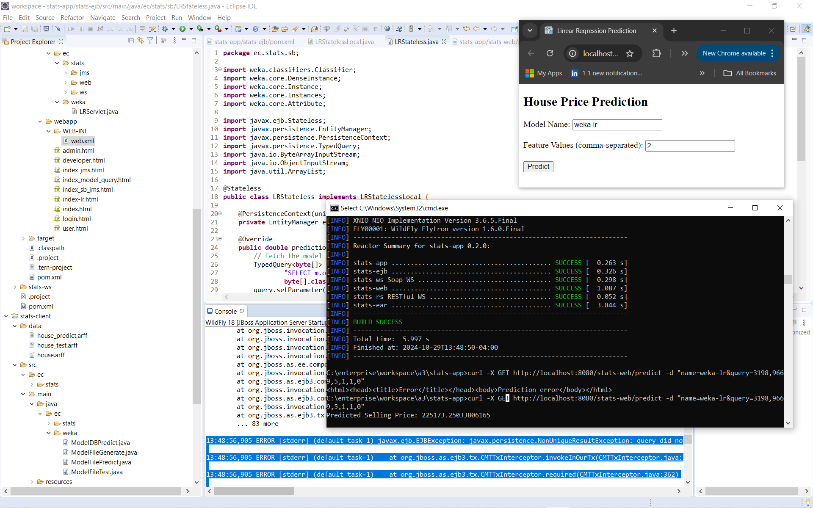
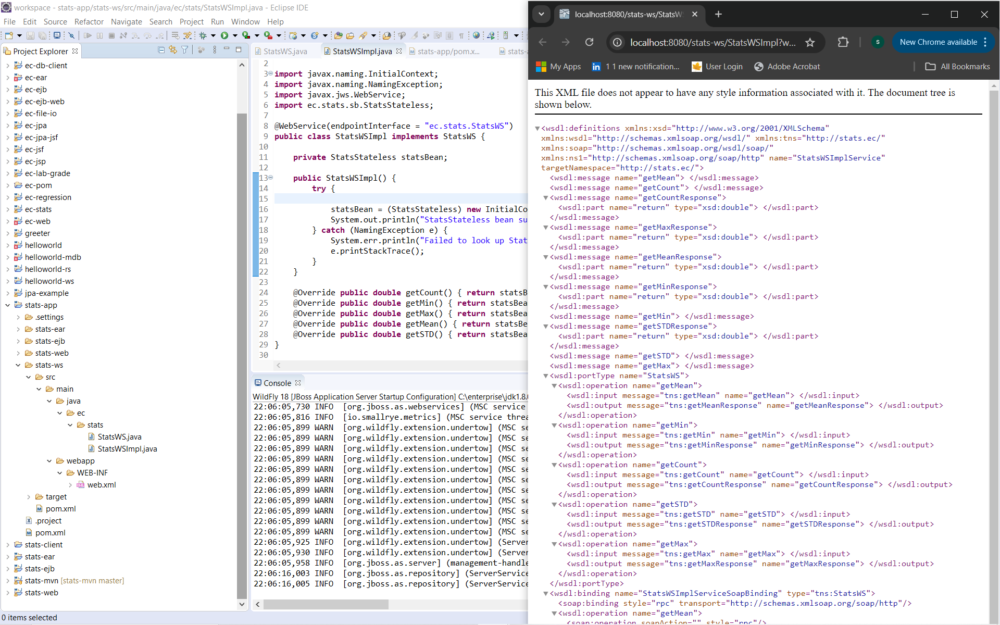
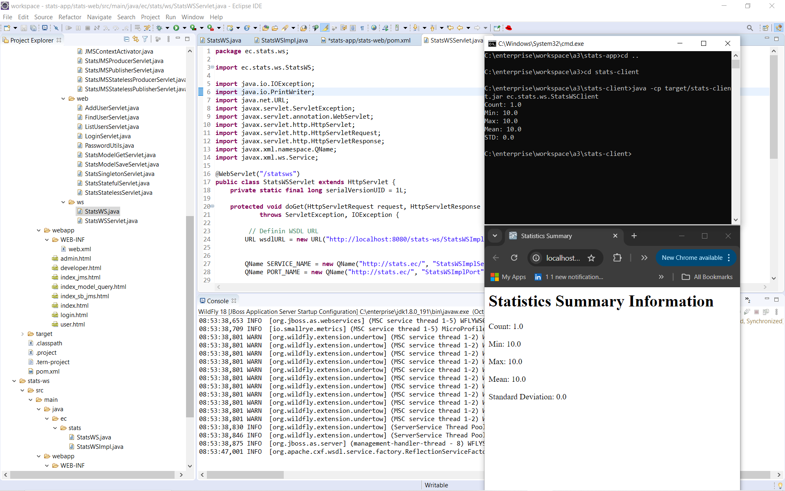
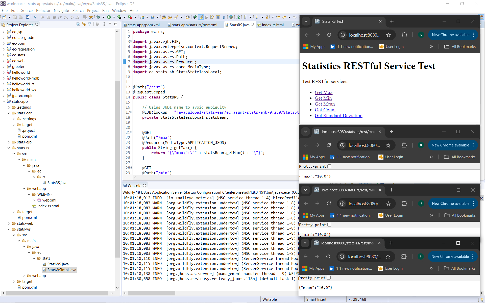

# 🧠 Enterprise ML–Statistics Integration Platform


**Tech Stack:** Java EE (EJB, JPA, JMS, JAX-WS, JAX-RS) | Weka API | WildFly 18 | MySQL | Maven  

---

## 📘 Overview

This is a comprehensive Java EE platform that unifies enterprise computing with machine learning. It integrates EJBs, JMS, SOAP, and REST services with Weka-based regression models for predictive analytics. Deployed on WildFly with JPA persistence and MySQL, it delivers end-to-end intelligent data processing and web service interaction.

This project integrates **machine-learning analytics** with a **distributed enterprise statistics platform**.  

It demonstrates how Weka-based regression models can be trained, stored, and served through standard enterprise middleware — including **EJBs**, **SOAP/REST web services**, and **JPA persistence** — within a modular WildFly deployment.

---

## 🏗️ Project Structure

```bash
Enterprise-ML–Statistics-Integration-Platform/
├── images/ # Documentation screenshots
├── ml-weka/ # Stand-alone ML module using Weka API
│ ├── data/ # Training & test ARFF datasets
│ ├── model/ # Serialized .bin and .json model files
│ └── src/main/java/ec/weka/ # Core Weka training & evaluation logic
│
├── stats-app/ # Multi-module enterprise application
│ ├── stats-ejb/ # Business logic, DAOs, ML–EJB integration
│ ├── stats-web/ # Servlets, SOAP endpoints, web pages
│ ├── stats-ws/ # SOAP Web-Service definition (WSDL)
│ └── stats-rs/ # RESTful JSON endpoints
│
└── stats-client/ # CLI clients for DB ops, SOAP, ML, and REST tests
```

Each module is independently deployable and communicates through standardized enterprise interfaces.

---

## ⚙️ Key Components

| Layer | Purpose |
|--------|----------|
| **EJB (stats-ejb)** | Hosts business logic, database persistence, and ML model invocation. |
| **SOAP (stats-ws)** | Exposes statistical computations over WSDL. |
| **REST (stats-rs)** | Provides JSON endpoints for lightweight service consumption. |
| **ML (ml-weka)** | Handles dataset parsing, model training, evaluation, and serialization using Weka. |
| **Client (stats-client)** | Runs model generation, testing, and predictions externally via CLI. |

---

## 🧩 Integration Workflow

1. **Train & Serialize ML Models** using Weka API.  
2. **Persist Models** into the enterprise database (`ecmodel` table) through JPA DAOs.  
3. **Expose Predictions** via EJBs, SOAP, and REST services.  
4. **Consume Services** through web dashboards and command-line clients.

---

## 🤖 Machine Learning Pipeline

###  Model Generation



**Explanation:**  
The ML module trains a **Linear Regression** model (`weka_lr`) on the `house.arff` dataset.  
Results (correlation = 0.897, RMSE ≈ 3276) confirm successful training and evaluation.  
Both binary (`.bin`) and JSON versions are produced for portability.

---

###  Model Persistence


**Explanation:**  
The serialized model is inserted as a BLOB in MySQL’s `ecmodel` table through the DAO layer (`StatsDBInsert`).  
This establishes persistent ML asset storage accessible to all enterprise modules.

---

###  EJB Integration



**Explanation:**  
`LRStateless` EJB retrieves the stored model, reconstructs the Weka classifier, and performs predictions using `classifyInstance()`.  
Predicted price ≈ 225,173 CAD, matching the standalone ML result — verifying model consistency across layers.

---

###  Web Interface



**Explanation:**  
The servlet form (`index-lr.html`) invokes the `LRStateless` EJB through JNDI lookup.  
Users input feature values and receive real-time predictions in the browser.  
Confirms proper Servlet → EJB → Model → Response chain.

---

## ☁️ SOAP & REST Web Services

###  SOAP Service (WSDL)




**Explanation:**  
The `StatsWSImpl` class exposes SOAP endpoints (`getCount`, `getMean`, `getSTD`, etc.).  
The generated WSDL defines all operations and bindings.  
`StatsWSClient` successfully consumes the service, displaying correct statistical results (Count = 1, Mean = 10).  

---

###  RESTful Service (JAX-RS)



**Explanation:**  
`StatsRS` exposes `/rest/max`, `/rest/min`, `/rest/mean`, and `/rest/std` endpoints that return JSON responses such as:  
```json
{"max":"10.0"}
{"mean":"10.0"}
```

These endpoints provide quick, stateless access to statistics computed by StatsStatelessLocal EJBs.

### 🔬 SOAP–REST–ML Convergence

The platform merges descriptive statistics and predictive analytics into one cohesive system:

SOAP/REST → Provide standardized interfaces for remote access.

EJB Layer → Bridges data persistence and ML model execution.

ML-Weka Module → Enables predictive intelligence.

Together they transform a traditional enterprise statistics engine into a service-oriented machine-learning platform.

# 🗄️ Persistence Configuration (JPA)
```bash
<persistence-unit name="primary" transaction-type="JTA">
  <jta-data-source>java:/MySqlDS</jta-data-source>
  <class>ec.stats.model.User</class>
  <class>ec.stats.model.Model</class>
  <properties>
    <property name="hibernate.dialect" value="org.hibernate.dialect.MySQL8Dialect"/>
    <property name="hibernate.hbm2ddl.auto" value="update"/>
    <property name="hibernate.show_sql" value="true"/>
  </properties>
</persistence-unit>
```


⚠️ Important Setup Note

- 1 Keep the Project Directory Structure Intact
  This platform relies on relative paths across modules (ml-weka, stats-app, stats-client).
  Do not rename or move the project root folder — keep it in the same structure:
  C:\enterprise\workspace\ec-git-projects\a3.

  If you move it, Maven builds and WildFly deployments may fail to locate the Weka models, ARFF files, or generated binaries.

- 2 Set System Environment Variables for Required Tools
  To ensure Weka, Java, and WildFly commands work globally:

  Add their bin directories to your Windows System PATH.

  Example setup:
  
  JAVA_HOME = C:\Program Files\Java\jdk-17
  WEKA_HOME = C:\Program Files\Weka-3-8
  WILDFLY_HOME = C:\wildfly-18.0.1.Final
  MAVEN_HOME = C:\apache-maven-3.9.9
  
  
  Then append these to your system Path:
  
  %JAVA_HOME%\bin;
  %WEKA_HOME%\;
  %WILDFLY_HOME%\bin;
  %MAVEN_HOME%\bin;
  
  
  Restart your terminal afterward to apply changes.

- 3 Verify Installations
  Run these to confirm everything is accessible:
  
  java -version
  mvn -v
  weka --help
  %WILDFLY_HOME%\bin\standalone.bat --version

----

### 🧪 Build & Run Instructions

1 Build all modules
mvn clean package

2 Deploy EAR to WildFly
cd stats-app
mvn wildfly:deploy

3 Access Services
http://localhost:8080/stats-web/          # Web UI
http://localhost:8080/stats-ws/StatsWS?wsdl  # SOAP WSDL
http://localhost:8080/stats-rs/rest/mean     # REST endpoint

4 Run ML Clients
cd ../stats-client
java -cp target/stats-client.jar ec.weka.ModelFileGenerate
java -cp target/stats-client.jar ec.weka.ModelDBPredict

5 MySQL setup (once)

```bash
1 Create DB + user

  CREATE DATABASE ec_platform DEFAULT CHARACTER SET utf8mb4 COLLATE utf8mb4_unicode_ci;
  CREATE USER 'ec_user'@'%' IDENTIFIED BY 'StrongPassword!123';
  GRANT ALL PRIVILEGES ON ec_platform.* TO 'ec_user'@'%';
  FLUSH PRIVILEGES;


2 (Optional) Verify connectivity from your machine:

mysql -h <MYSQL_HOST> -P 3306 -u ec_user -p ec_platform -e "SELECT 1;"

```

6 WildFly: add MySQL driver + datasource

- Do this inside your WildFly install dir. Replace X.Y.Z with your MySQL Connector/J version (e.g., 8.3.0) and WILDFLY_HOME with your path.

7 Install MySQL JDBC driver as a module

```bash
mkdir -p %WILDFLY_HOME%\modules\system\layers\base\com\mysql\main
copy mysql-connector-j-X.Y.Z.jar %WILDFLY_HOME%\modules\system\layers\base\com\mysql\main\
```

8 Create %WILDFLY_HOME%\modules\system\layers\base\com\mysql\main\module.xml:

<?xml version="1.0" encoding="UTF-8"?>
<module xmlns="urn:jboss:module:1.9" name="com.mysql">
  <resources>
    <resource-root path="mysql-connector-j-X.Y.Z.jar"/>
  </resources>
  <dependencies>
    <module name="javax.api"/>
    <module name="javax.transaction.api"/>
  </dependencies>
</module>


9 Start WildFly (standalone)

```bash
%WILDFLY_HOME%\bin\standalone.bat
```

10 Add the JDBC driver & datasource via CLI (new terminal):

```bash
%WILDFLY_HOME%\bin\jboss-cli.bat --connect
```
Register the driver
/subsystem=datasources/jdbc-driver=mysql:add(driver-name=mysql,driver-module-name=com.mysql,driver-class-name=com.mysql.cj.jdbc.Driver)

Add the datasource expected by persistence.xml
data-source add \
  --name=MySqlDS \
  --jndi-name=java:/MySqlDS \
  --driver-name=mysql \
  --connection-url=jdbc:mysql://<MYSQL_HOST>:3306/ec_platform?useSSL=false&allowPublicKeyRetrieval=true&serverTimezone=UTC \
  --user-name=ec_user \
  --password=StrongPassword!123 \
  --min-pool-size=5 \
  --max-pool-size=20 \
  --valid-connection-checker-class-name=org.jboss.jca.adapters.jdbc.extensions.mysql.MySQLValidConnectionChecker \
  --exception-sorter-class-name=org.jboss.jca.adapters.jdbc.extensions.mysql.MySQLExceptionSorter

Test the datasource
/subsystem=datasources/data-source=MySqlDS:test-connection-in-pool

Confirm JPA picks it up

- The persistence.xml uses:

```bash
<jta-data-source>java:/MySqlDS</jta-data-source>
<property name="hibernate.hbm2ddl.auto" value="update"/>
```

- So on first deploy, Hibernate will auto-create/update tables (ecuser, ecmodel, etc.) in ec_platform. Check logs for Hibernate: create table… lines, or verify in MySQL:

  SHOW TABLES FROM ec_platform;
  SELECT * FROM ecmodel LIMIT 5;

Secure secrets (recommended)

- Prefer env vars + CLI expressions rather than plain passwords:

  /subsystem=datasources/data-source=MySqlDS:write-attribute(name=password,value="${VAULT_DB_PASSWORD:StrongPassword!123}")


Or use WildFly Elytron credential store for production.


### 🧾 Validation Summary

| Component | Technology             | Output Verified                    |
| --------- | ---------------------- | ---------------------------------- |
| ML Model  | Weka API               | Correlation = 0.897  RMSE = 3276   |
| DB Layer  | JPA / MySQL            | `ecmodel` contains `weka_lr` entry |
| EJB       | Stateless Session Bean | Prediction = 225173 CAD            |
| SOAP WS   | JAX-WS                 | XML WSDL + valid service responses |
| REST API  | JAX-RS                 | JSON stats `{ "mean": "10.0" }`    |
| Web UI    | HTML + Servlet         | Live prediction workflow           |

### 🚀 Future Enhancements

Add REST endpoints for uploading and testing multiple ML models.

Implement role-based access control via Elytron.

Introduce batch prediction and model versioning.

Containerize with Docker Compose (WildFly + MySQL + Weka).

### 📚 Summary

This project demonstrates the unification of enterprise computing and machine learning:
statistical services are extended with predictive power through Weka, accessible via SOAP, REST, and EJB layers — all under a clean, modular Jakarta EE architecture.
